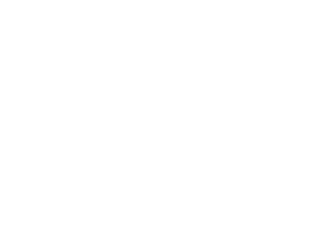
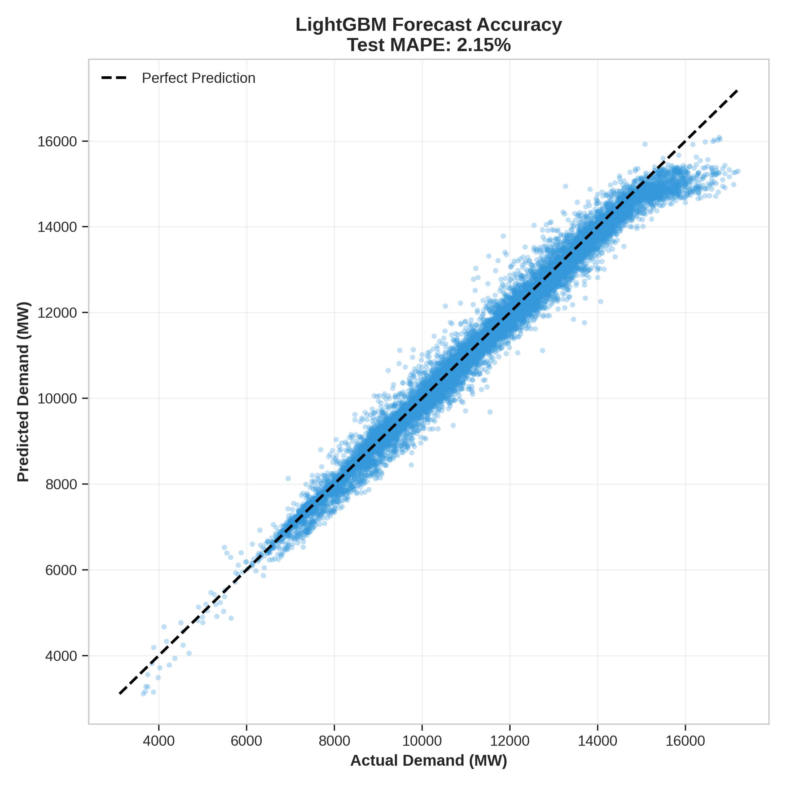
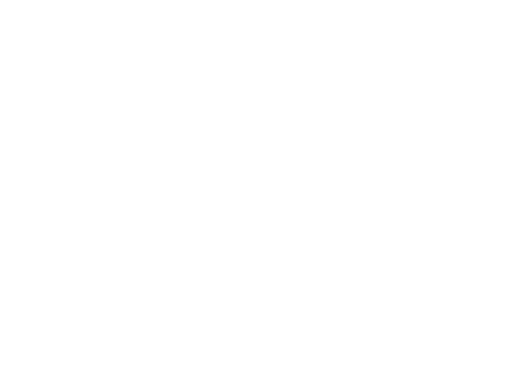

# ⚡️ PGCB Electricity Demand Forecasting: A Machine Learning Approach

**Project:** Predictive Paradox  
**Objective:** Engineer a highly optimized, classical machine learning pipeline to forecast electricity demand for the Power Grid Company of Bangladesh (PGCB), strictly utilizing historical load data, temporal structures, and macroeconomic weather variables.

**Performance Benchmark:** Achieved a **2.15% Test MAPE** on entirely unseen 2024 grid data.

---

## 🚀 Project Architecture & Methodology

### Step 1: Diagnostic Exploratory Data Analysis (EDA)
**The Process:** We mapped distribution density, plotted chronological time series, and generated missing-value heatmaps across the raw datasets.
* **The Rationale:** Power grids are physical systems prone to sensor failures and manual load-shedding. We had to visually confirm the presence of anomalies and identify the distribution of missing weather data before applying blind transformations.
* We rejected the use of automated outlier deletion (like standard Z-score removal) because in power grids, extreme peaks (e.g., severe heatwaves) are true physical events, not statistical errors. Dropping them blindly would cripple the model's ability to predict peak loads.

### Step 2: Data Cleaning & Imputation
**The Process:** 1. Applied **Linear Interpolation** to smoothly bridge short-duration missing values without breaking the daily curve.
2. Deployed the **Seasonal Extreme Studentized Deviate (S-ESD)** algorithm for rigorous anomaly detection.
3. Extracted and aligned key structural indicators from the **Economic Dataset** to match our hourly timestamps.
* **The Rationale:** Standard outlier detection (like IQR or Z-scores) fundamentally fails on cyclical grid data because legitimate summer peaks are falsely flagged as mathematical outliers. **S-ESD** solves this by first decomposing the time series (stripping away the expected seasonality and macro-trend) and running anomaly detection. This allowed us to pinpoint true mechanical failures (like load shedding) without destroying critical peak-load data. Furthermore, integrating extracted economic indicators provided the model with a vital proxy for long-term structural grid growth.

### Step 3: Feature Engineering (Temporal & Lag Mechanics)
**The Process:** 1. Dropped all concurrent generation/fuel-mix variables (Gas, Coal, Hydro) to prevent target leakage.
2. Applied **Sine/Cosine transformations** to `Hour`, `Day`, and `Month` to map time cyclically.
3. Engineered precise **Autoregressive Lags:** `1h`, `2h`, `24h`, and `168h`.
4. Engineered **Rolling Window Statistics:** Calculated the rolling mean and rolling standard deviation for `6h` and `24h` periods.
* **The Rationale:** * *Cyclic Time:* Prevented the model from viewing Hour 23 and Hour 0 as mathematically distant.
  * *Lags:* The `1h` and `2h` lags capture the immediate thermodynamic inertia of the grid, while the `24h` and `168h` lags anchor the model to strict daily and weekly human behavioral cycles. 
  * *Rolling Windows:* The rolling means smooth out micro-volatility to reveal the true underlying trend, while the rolling standard deviations explicitly feed the current volatility/stability state of the grid into the tree's decision-making process.

### Step 4: Model Selection & Baseline Testing
**The Process:** 1. **Target Variable Formulation:** We explicitly created our target variable (`target_demand`) by shifting the actual demand column backward by our exact forecasting horizon.
* **The Rationale:** * *Target Shifting:* If the target variable is not shifted, a model will inadvertently train on the current hour's demand to predict the current hour's demand (a 100% correlation target leak). By shifting the demand column, we structurally align the features at time $t$ with the demand at time $t+n$, mathematically guaranteeing that no future data leaks into the training rows.

We then tested four classical algorithms against a strict chronological hold-out set (Train: 2015-2022, Test: 2024).
  * *Linear Regression (2.80% MAPE):* Successfully predicted the macro-trend (extrapolation) but failed to capture daily micro-cycles.
  * *Random Forest (4.95% MAPE):* Captured daily cycles but completely failed to extrapolate future growth due to strict data starvation.
  * *LightGBM (3.69% MAPE) & XGBoost (4.67% MAPE):* Showed superior cyclic understanding but hit the same extrapolation ceiling.
* **The Champion Selection:** **LightGBM** was selected as the final architecture.
* **Rejected Alternative (XGBoost):** While mathematically similar, LightGBM's native **Histogram Binning** allows it to group continuous weather variables into discrete buckets, dropping memory usage and drastically increasing training speed. Furthermore, LightGBM's **Leaf-wise tree growth** aggressively targets high-error segments (asymmetrical anomalies) better than XGBoost's symmetrical level-wise growth.

### Step 5: Hyperparameter Optimization
**The Process:** Implemented `RandomizedSearchCV` paired with `TimeSeriesSplit`.
* **The Rationale:** We strictly optimized tree depth, learning rate, and leaf capacity (`max_depth=6`, `num_leaves=31`) to force the model to generalize. `TimeSeriesSplit` was mandatory to ensure cross-validation occurred chronologically (e.g., Train 2015-2020 -> Validate 2021).
* We strictly rejected standard `K-Fold Cross Validation`. Standard K-Fold shuffles time series data randomly, allowing the model to look into the "future" to predict the "past," resulting in catastrophic temporal data leakage and invalid models. 

### Step 6: Final Production Model & Evaluation
**The Process:** The optimized LightGBM model was refit on the absolute maximum available historical data (2015-2023) and evaluated strictly on the unseen **2024 test matrix**.
* **The Result:** The model achieved a **2.15% Test MAPE**, proving it successfully learned the grid physics without memorizing the noise. The 2023 data acted as the necessary baseline ladder to predict the higher 2024 loads, fully solving the tree-extrapolation limitation.

---

## 📊 Visual Interpretation & Insights

### 1. High-Resolution Forecast Tracking
This 10-day zoom window proves the model's structural logic. It seamlessly captures the non-linear peaks and valleys of daily electricity demand, successfully mapping thermodynamic cooling loads without drifting from the actual megawatt baseline.

### 2. Model Accuracy Distribution
The tight clustering around the 45-degree reference line visually confirms our highly competitive **2.15% Test MAPE**. The model maintains structural integrity across both low-load (nighttime) and high-load (peak evening) scenarios.

### 3. Algorithmic Logic (Feature Importance)
Extracting the internal node-splitting weights reveals the core drivers of grid demand. Autoregressive lag features act as the primary structural baseline, while the cyclical temporal encodings and thermodynamic weather data dictate the precise hour-by-hour variance.

---

## 💾 Reproducibility
The completely cleaned and engineered dataset (`pgcb_cleaned_demand.csv`), along with the raw training data, is included in this repository. 

To reproduce this project:
1. Clone this repository: `git clone https://github.com/strawhatjpg/Predictive_Paradox.git`
2. Install the required libraries: `pip install -r requirements.txt`
3. Open `notebooks/predictive_paradox_cleaning.ipynb` and run all cells.
